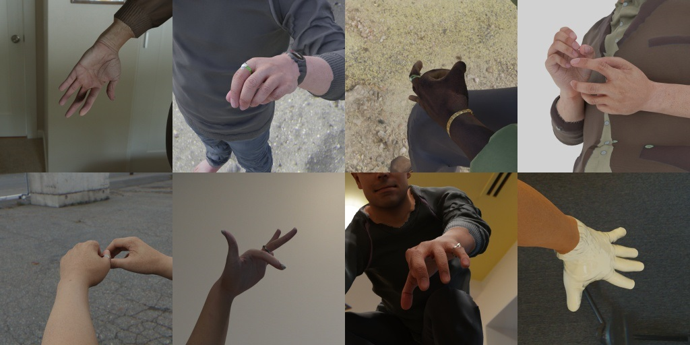

# SynthMoCap Datasets

In all datasets samples are indexed by identity and frame - there are approximately 20,000 identities in each dataset
with 5 frames each. Indices are formatted with leading zeros, for example `img_0000123_004.jpg` for identity 123, frame 4.
Note that some pose data is sourced from the [AMASS](https://amass.is.tue.mpg.de/) and [MANO](https://mano.is.tue.mpg.de/)
datasets and is not directly redistributed by us. This data will be downloaded and spliced into the full dataset as part
of the `download_data.py` script.

## SynthBody


### Download Instructions

The following command will download the dataset to `YOUR_DATA_DIRECTORY/synth_body/`:

```bash
python download_data.py --dataset body --output_dir YOUR_DATA_DIRECTORY/
```

### Contents

Image Data:

| Data Type | File Name |
|-|-|
|RGB image| `img_XXXXXXX_XXX.jpg`|
| Grayscale beard segmentation| `segm_beard_XXXXXXX_XXX.png`|
| Grayscale eyebrows segmentation| `segm_eyebrows_XXXXXXX_XXX.png`|
| Grayscale eyelashes segmentation| `segm_eyelashes_XXXXXXX_XXX.png`|
| Grayscale facewear segmentation| `segm_facewear_XXXXXXX_XXX.png`|
| Grayscale glasses segmentation| `segm_glasses_XXXXXXX_XXX.png`|
| Grayscale head hair segmentation| `segm_hair_XXXXXXX_XXX.png`|
| Grayscale headwear segmentation| `segm_headwear_XXXXXXX_XXX.png`|
| Integer body parts segmentation| `segm_parts_XXXXXXX_XXX.png`|

Segmentation parts indices:

|Class|Index|
|-|-|
|BACKGROUND|0|
|FACE|1|
|LEFT_UPPER_TORSO|2|
|LEFT_LOWER_TORSO|3|
|RIGHT_UPPER_TORSO|4|
|RIGHT_LOWER_TORSO|5|
|LEFT_UPPER_LEG|6|
|LEFT_LOWER_LEG|7|
|LEFT_FOOT|8|
|RIGHT_UPPER_LEG|9|
|RIGHT_LOWER_LEG|10|
|RIGHT_FOOT|11|
|LEFT_UPPER_ARM|12|
|LEFT_LOWER_ARM|13|
|LEFT_HAND|14|
|RIGHT_UPPER_ARM|15|
|RIGHT_LOWER_ARM|16|
|RIGHT_HAND|17|

Metadata:

```json
{
    "camera": {
        "world_to_camera": [ "4x4 array of camera extrinsics" ],
        "camera_to_image": [ "3x3 array of camera intrinsics" ],
        "resolution": [
            512,
            512
        ]
    },
    "pose": [ " 52x3 array of SMPL-H pose parameters" ],
    "translation": [ "3 element array for SMPL-H translation" ],
    "body_identity": [ "300 element array of neutral SMPL-H parameters" ],
    "hand_identity": [ "10 element array of MANO shape parameters" ],
    "landmarks": {
        "3D_world": [ "52x3 array of 3D landmarks in world-space corresponding to SMPL-H joints" ],
        "3D_cam": [ "52x3 array of 3D landmarks in camera-space corresponding to SMPL-H joints" ],
        "2D": [ "52x2 array of 2D landmarks in image-space corresponding to SMPL-H joints" ]
    }
}
```

Landmarks:

TODO landmarks visualization

## SynthFace


### Download Instructions

The following command will download the dataset to `YOUR_DATA_DIRECTORY/synth_face/`:

```bash
python download_data.py --dataset face --output_dir /YOUR_DATA_DIRECTORY/
```

### Contents

Image Data:

| Data Type | File Name |
|-|-|
|RGB image|`img_XXXXXXX_XXX.jpg`|
|Grayscale beard segmentation|`segm_beard_XXXXXXX_XXX.png`|
|Grayscale clothing segmentation|`segm_clothing_XXXXXXX_XXX.png`|
|Grayscale eyebrows segmentation|`segm_eyebrows_XXXXXXX_XXX.png`|
|Grayscale eyelashes segmentation|`segm_eyelashes_XXXXXXX_XXX.png`|
|Grayscale facewear segmentation|`segm_facewear_XXXXXXX_XXX.png`|
|Grayscale glasses segmentation|`segm_glasses_XXXXXXX_XXX.png`|
|Grayscale head hair segmentation|`segm_hair_XXXXXXX_XXX.png`|
|Grayscale headwear segmentation|`segm_headwear_XXXXXXX_XXX.png`|
|Integer face parts segmentation|`segm_parts_XXXXXXX_XXX.png`|

Segmentation parts indices:

|Class|Index|
|-|-|
|BACKGROUND|0|
|SKIN|1|
|NOSE|2|
|RIGHT_EYE|3|
|LEFT_EYE|4|
|RIGHT_BROW|5|
|LEFT_BROW|6|
|RIGHT_EAR|7|
|LEFT_EAR|8|
|MOUTH_INTERIOR|9|
|TOP_LIP|10|
|BOTTOM_LIP|11|
|NECK|12|

Metadata:

```json
{
    "camera": {
        "world_to_camera": [ "4x4 array of camera extrinsics" ],
        "camera_to_image": [ "3x3 array of camera intrinsics" ],
        "resolution": [
            512,
            512
        ]
    },
    "head_pose": [ "3x3 rotation matrix of the head" ],
    "left_eye_pose": [ "3x3 rotation matrix of the left eye"],
    "right_eye_pose": [ "3x3 rotation matrix of the right eye" ],
    "landmarks": {
        "2D": [ "70x2 array of landmarks in image space" ]
    }
}
```

Landmarks:

TODO landmarks visualization

## SynthHand



### Download Instructions

The following command will download the dataset to `YOUR_DATA_DIRECTORY/synth_hand/`:

```bash
python download_data.py --dataset hand --output_dir /YOUR_DATA_DIRECTORY/
```

### Contents

Image Data:

| Data Type | File Name |
|-|-|
|RGB image|`img_XXXXXXX_XXX.jpg`|

Metadata:

```json
{
    "camera": {
        "world_to_camera": [ "4x4 array of camera extrinsics" ],
        "camera_to_image": [ "3x3 array of camera intrinsics" ],
        "resolution": [
            512,
            512
        ]
    },
    "pose": [ " 52x3 array of SMPL-H pose parameters" ],
    "translation": [ "3 element array for SMPL-H translation" ],
    "body_identity": [ "300 element array of neutral SMPL-H parameters" ],
    "hand_identity": [ "10 element array of MANO shape parameters" ],
    "landmarks": {
        "3D_world": [ "21x3 array of 3D landmarks in world-space - first 15 elements are MANO joints, last 5 are finger tips" ],
        "3D_cam": [ "21x3 array of 3D landmarks in camera-space - first 15 elements are MANO joints, last 5 are finger tips" ],
        "2D": [ "21x2 array of 2D landmarks in image-space - first 15 elements are MANO joints, last 5 are finger tips" ]
    }
}
```

Landmarks:

TODO landmarks visualization
